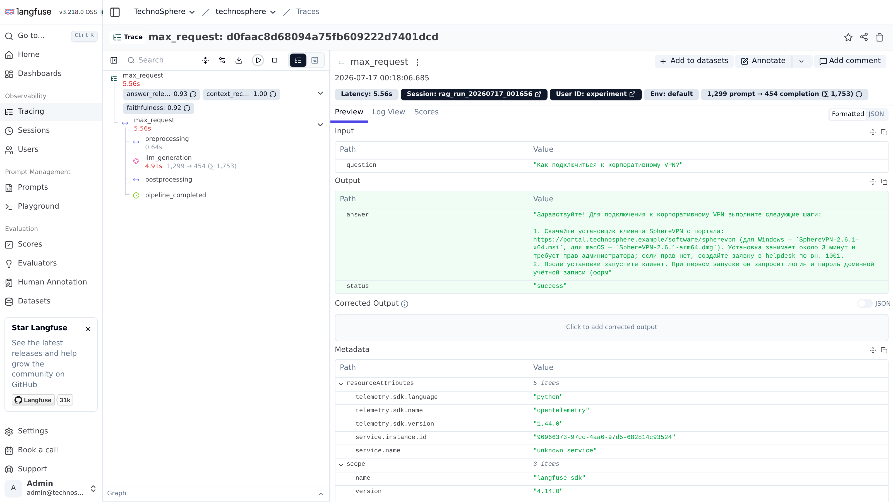

# max-technical-helper


Внутрикорпоративный интеллектуальный ассистент (IT/HR) в мессенджере **Max**.
Отвечает на вопросы сотрудников фактами из корпоративной Базы Знаний через **RAG**
(YandexGPT + ChromaDB), ищет коллег в справочнике сотрудников, адаптируется под
корпоративный Tone of Voice через **LoRA fine-tuning**, наблюдается через
**Langfuse** и защищён от деградации качества **Ragas quality gate** в CI/CD.

Действующий бот: https://max.ru/id9704272208_3_bot

> Все данные проекта на 100% синтетические (см. [раздел «Данные»](#данные--100-синтетика)).

## Архитектура

```
                    ┌──────────────────────────────────────────────────────┐
                    │                 Langfuse (self-hosted)               │
                    │  web :3000 / worker / postgres / clickhouse / minio  │
                    └────────────────────▲─────────────────────────────────┘
                                         │ трейсы: spans, generation,
                                         │ user_id, session_id, scores
 Пользователь Max                        │
        │ сообщение                      │
        ▼                                │
 ┌─────────────┐   long-polling   ┌──────┴───────┐
 │  Max (app)  │◄────────────────►│  max_bot.py  │  /start, текст и голос,
 └─────────────┘                  │   (maxapi)   │  сессионная память
                                  └──────┬───────┘
                                         │ Assistant.reply
                                         ▼
                                   ┌───────────┐   запрос про человека
                                   │  роутер   │──────────────┐
                                   └─────┬─────┘              ▼
                                         │            ┌───────────────┐
                                         │ иначе      │  people.py    │
                                         ▼            │ rapidfuzz по  │
                                   ┌───────────┐      │ employees.json│
                                   │ RAG chain │      └───────────────┘
                                   └─────┬─────┘
            ┌────────────────────────────┼───────────────────────────┐
            ▼                            ▼                           ▼
   ┌─────────────────┐        ┌──────────────────┐        ┌───────────────────┐
   │ Yandex Embed    │        │ ChromaDB         │        │ YandexGPT         │
   │ text-search-    │───────►│ persist ./       │───────►│ deepseek-v4-flash │
   │ query           │ query  │ chroma_db        │ топ-4  │ строгий промпт    │
   └─────────────────┘        └──────────────────┘ чанков  │ «только по       │
                                                         │ контексту»        │
                                                         └───────────────────┘

 Индексация (офлайн): data/kb/*.md → heading-aware чанкинг (800 симв., overlap 100)
                      → Yandex text-search-doc → ChromaDB (метаданные {source, title, doc_id})
```

Особенности диалога в Max:

- индикатор «печатает…», пока ассистент готовит ответ (LLM может думать десятки секунд);
- ответы в Markdown (`format=markdown`): разметка LLM санитизируется под диалект
  MAX (`src/bot/formatting.py`) — заголовки → жирный текст, `---` убираются;
- поиск коллег по справочнику сотрудников (`src/rag/people.py`, rapidfuzz, без LLM):
  по ФИО с учётом склонений и опечаток («найди Николаеву») и по должности
  («кто генеральный директор?»); при неоднозначности бот предлагает варианты
  списком и понимает короткий follow-up («Степанов» после списка кандидатов);
- голосовые сообщения распознаются через Yandex SpeechKit STT (`src/bot/speech.py`),
  распознанный текст обрабатывается как обычный вопрос (с историей диалога).
  Известный баг платформы: в long-polling нативные голосовые для новых ботов
  приходят как `message_created` без тела и недоступны в `GET /messages`
  ([max-bot-api-client-ts#250](https://github.com/max-messenger/max-bot-api-client-ts/issues/250)).
  В webhook-режиме голосовые доставляются полностью (проверено) — поэтому он
  и является рабочим режимом для голосового ввода; пустые обновления логируются.

## Стек

| Слой | Технология |
|---|---|
| Язык / рантайм | Python 3.12 |
| Бот | maxapi (long-polling / webhook), asyncio |
| LLM | YandexGPT `deepseek-v4-flash` через OpenAI-совместимый API |
| Embeddings | Yandex `text-search-doc` / `text-search-query` |
| Векторная БД | ChromaDB (persist на диске, cosine) |
| Оркестрация RAG | LangChain (без агентов) |
| Поиск сотрудников | rapidfuzz (детерминированный, без LLM) |
| Observability | Langfuse 3 self-hosted (docker-compose) |
| Оценка качества | Ragas 0.2 (faithfulness / answer_relevancy / context_recall) |
| Fine-tuning | Qwen2.5-1.5B-Instruct + LoRA (peft, transformers, torch CPU) |
| Тесты / CI | pytest, pytest-html, GitHub Actions |
| Развёртывание | Docker, docker-compose |

## Структура репозитория

```
max-technical-helper/
├── src/
│   ├── config.py               # pydantic-settings: вся конфигурация из env
│   ├── data_gen/
│   │   ├── ad_gen.py           # генератор employees.json — 120 сотрудников (Faker, фикс. seed)
│   │   └── finetune_gen.py     # генератор dataset.jsonl — 198 пар ChatML для LoRA
│   ├── rag/
│   │   ├── embeddings.py       # YandexEmbeddings (doc/query), retry с backoff на 429
│   │   ├── indexing.py         # heading-aware чанкинг → ChromaDB, метаданные {source,title,doc_id}
│   │   ├── chain.py            # RAG: retrieval → строгий промпт → YandexGPT; трейсинг
│   │   └── people.py           # детерминированный поиск сотрудников (rapidfuzz)
│   ├── bot/
│   │   ├── max_bot.py          # точка входа бота Max (long-polling)
│   │   ├── assistant.py        # роутер: справочник сотрудников → RAG
│   │   └── session.py          # сессионная память (последние 6 реплик, deque)
│   ├── observability/
│   │   └── tracing.py          # Langfuse-клиент + fail-safe обёртки над SDK
│   ├── eval/
│   │   ├── run_ragas.py        # Ragas-оценка goldens → tests/ragas_results.json
│   │   ├── langfuse_experiment.py  # Langfuse dataset + run + Ragas-scores на трейсах
│   │   └── ragas_compat.py     # заглушки совместимости для ragas 0.2.x
│   └── finetune/
│       └── train_lora.py       # LoRA-обучение (r=16, alpha=32, CPU/GPU)
├── data/
│   ├── kb/                     # 28 статей БЗ (14 IT + 14 HR), YAML frontmatter
│   ├── ad/employees.json       # 120 синтетических сотрудников (AD mock)
│   ├── finetune/dataset.jsonl  # 198 пар «вопрос сотрудника → идеальный ответ»
│   └── eval/goldens.json       # 16 эталонов для Ragas (12 KB + 2 people + 2 OOD)
├── tests/                      # pytest: юнит-тесты + Ragas quality gate
├── .github/workflows/ci.yml    # CI: юнит-тесты → индекс → Ragas → quality gate
├── docker-compose.yml          # Langfuse-стек + сервис bot
├── Dockerfile                  # образ бота (+ корневые сертификаты Минцифры)
├── certs/                      # сертификаты Минцифры для сборки образа
├── requirements.txt            # зависимости приложения и тестов
├── requirements-finetune.txt   # зависимости для LoRA-обучения (torch CPU)
├── requirements-dev.txt        # зависимости для сборки презентации
├── .env.example
└── reports/                    # metrics_report.md, логи LoRA, скриншоты
```

## Quick Start

### 1. Окружение и зависимости

```bash
python3.12 -m venv .venv
.venv/bin/pip install -r requirements.txt
cp .env.example .env   # заполнить значения
```

Переменные окружения (`.env`):

| Переменная | Обязательна | Описание |
|---|---|---|
| `YANDEX_API_KEY` | да | API-ключ сервисного аккаунта Yandex Cloud |
| `YANDEX_FOLDER_ID` | да | ID каталога Yandex Cloud |
| `YANDEX_LLM_MODEL` | нет | Модель YandexGPT (по умолчанию `deepseek-v4-flash`) |
| `MAX_BOT_TOKEN` | да (для бота) | Токен бота Max |
| `MAX_MODE` | нет | `polling` (по умолчанию) или `webhook` — см. «Webhook-режим» ниже |
| `WEBHOOK_URL` | для webhook | Публичный HTTPS-адрес без пути, например `https://example.ru` |
| `WEBHOOK_SECRET` | для webhook | Секрет проверки заголовка `X-Max-Bot-Api-Secret` |
| `LANGFUSE_PUBLIC_KEY` | нет | Публичный ключ проекта Langfuse (без ключей трейсинг молча отключается) |
| `LANGFUSE_SECRET_KEY` | нет | Секретный ключ проекта Langfuse |
| `LANGFUSE_BASE_URL` | нет | Адрес Langfuse (по умолчанию `http://localhost:3000`) |

### 2. Индексация Базы Знаний

```bash
.venv/bin/python -c "from src.config import get_settings; from src.rag.indexing import build_index; build_index(get_settings())"
```

Собирает чанки из `data/kb/*.md` в `chroma_db/` (Yandex-эмбеддинги, поэтому нужны
`YANDEX_API_KEY`/`YANDEX_FOLDER_ID`). Бот при старте сам пересобирает индекс,
если коллекция пуста.

### 3. Запуск бота локально

```bash
.venv/bin/python -m src.bot.max_bot
```

### 4. Запуск всего стека в Docker (Langfuse + бот)

```bash
docker compose up -d --build
```

**Нюанс snap-сборки Docker.** Если Docker установлен через snap, CLI не может
читать файлы вне разрешённых путей (например, `/srv/...`) и падает на чтении
`docker-compose.yml`. Workaround — передать compose-файл через stdin и подгрузить
переменные из `.env` вручную (именно так стек запускается на нашем сервере):

```bash
set -a && . ./.env && set +a && docker compose -f - up -d --build < docker-compose.yml
```

В compose-файле задано фиксированное имя проекта `name: langfuse`, поэтому при
запуске через stdin проект не превращается в `void`.

После старта: Langfuse UI — http://localhost:3000 (логин/пароль задаются
переменными `LANGFUSE_INIT_USER_*` в `.env`), бот отвечает в Max.

### 5. Webhook-режим (production)

По умолчанию бот получает обновления через long-polling (`MAX_MODE=polling`) —
для разработки этого достаточно, но MAX рекомендует webhook для production:
polling ограничен по скорости и сроку хранения событий. Кроме того, в polling
у новых ботов нативные голосовые приходят пустыми (см. «Особенности диалога»
выше), а через webhook доставляются полностью — голосовой ввод требует webhook.

Боту нужен публичный HTTPS-адрес на 443 порту с доверенным сертификатом.
Проверенный вариант без своего домена — туннель [CloudPub](https://cloudpub.ru)
(ngrok из РФ недоступен: блокирует подключения с российских IP):

```bash
# утилита clo — https://cloudpub.ru/download
clo set token <API-ключ из личного кабинета CloudPub>
clo publish http 8080
# Сервис опубликован: http://localhost:8080 -> https://<имя>.cloudpub.ru:443
```

Полученный адрес вносим в `.env` и запускаем бота:

```bash
MAX_MODE=webhook
WEBHOOK_URL=https://<имя>.cloudpub.ru  # публичный базовый URL, без пути
WEBHOOK_PATH=/webhook/max              # опционально, значение по умолчанию
WEBHOOK_SECRET=<случайная строка>      # проверка X-Max-Bot-Api-Secret
WEBHOOK_PORT=8080                      # порт aiohttp-сервера
```

При старте бот сам оформляет подписку (`POST /subscriptions`) на
`{WEBHOOK_URL}{WEBHOOK_PATH}` и поднимает aiohttp-сервер на `127.0.0.1:8080`;
туннель проксирует на него публичный 443-й порт (сертификат GlobalSign проходит
TLS-проверку MAX).

Вариант со своим сервером и доменом: сервис `bot` в docker-compose пробрасывает
`${WEBHOOK_PORT}` на `127.0.0.1` хоста — достаточно направить на него nginx:

```nginx
location /webhook/max {
    proxy_pass http://127.0.0.1:8080;
    proxy_set_header Host $host;
    proxy_set_header X-Real-IP $remote_addr;
}
```

## Тесты и качество

### Юнит-тесты

```bash
.venv/bin/pytest tests -v --ignore=tests/test_ragas.py
```

Покрывают: чанкинг и метаданные БЗ, формат KB и AD-данных, поиск сотрудников
(опечатки, однофамильцы, руководитель), конфиг, роутинг бота, формат датасета
LoRA, fail-safe трейсинга.

### Ragas quality gate

```bash
# нужен собранный индекс и ключи Yandex в .env; ходит в API, занимает минуты
.venv/bin/pytest tests/test_ragas.py -v
```

Прогоняет эталоны `data/eval/goldens.json` через живой RAG-пайплайн, считает
метрики Ragas (evaluator — тот же `deepseek-v4-flash`) и падает, если средние
ниже порогов. Результаты и детализация по каждому эталону — в
`tests/ragas_results.json`, сводный отчёт — в [reports/metrics_report.md](reports/metrics_report.md).

| Метрика | Порог | Факт |
|---|---|---|
| Faithfulness | ≥ 0.7 | **0.850** |
| Answer Relevancy | ≥ 0.7 | **0.833** |
| Context Recall | ≥ 0.6 | **1.000** |

OOD-эталоны (вопросы вне БЗ) в среднее не входят (см. `note` в JSON) — защита от
галлюцинаций для них проверяется отдельным тестом `test_no_hallucinations`.

### CI (GitHub Actions)

Workflow `.github/workflows/ci.yml` (push / PR / ручной запуск):

1. установка зависимостей (Python 3.12);
2. юнит-тесты с HTML-отчётом;
3. сборка индекса ChromaDB;
4. Ragas-оценка → `tests/ragas_results.json`;
5. **Quality Gate** — падение пайплайна, если метрика ниже порога;
6. загрузка артефактов (HTML-отчёты pytest, `ragas_results.json`).

Требуемые secrets репозитория: `YANDEX_API_KEY`, `YANDEX_FOLDER_ID`.

## Fine-tuning (LoRA)

Базовая модель — `Qwen/Qwen2.5-1.5B-Instruct`, адаптер LoRA: **r=16, alpha=32,
dropout 0.05**, все projection-слои (`q/k/v/o/gate/up/down_proj`), обучаемых
параметров ~18.5 млн (~1.18%). Датасет — `data/finetune/dataset.jsonl`, **198
пар** в формате ChatML («вопрос сотрудника → идеальный ответ оператора» в
корпоративном стиле). Обучение на нашем CPU-сервере: 2 эпохи, lr 1e-4,
batch 1 × grad accumulation 8, dtype bfloat16.

```bash
.venv/bin/pip install -r requirements-finetune.txt
.venv/bin/python -m src.finetune.train_lora
# адаптер сохраняется в models/lora_adapter/
```

Переопределения через env: `FINETUNE_BASE_MODEL`, `FINETUNE_MAX_EXAMPLES`
(smoke-прогоны), `FINETUNE_EPOCHS`, `FINETUNE_OUTPUT_DIR`, `FINETUNE_DTYPE`
(float32 | bfloat16 | auto), `FINETUNE_USE_CPU` (1 | 0).

> **Результаты Base vs Fine-Tuned** (подробно — `reports/finetune_report.md`):
> обучение LoRA на 198 парах (train_loss 2.224 → 0.952); доля ответов,
> начинающихся с корпоративного приветствия, — 8% → **100%**; оценка
> соответствия корпоративному стилю (LLM-as-judge, 1–5) — 3.5 → **4.75**.
> Вывод: LoRA переняла Tone of Voice, фактологию обеспечивает RAG-контур.

### Как переключить на Qwen2.5-7B на GPU

Конфиг обучения параметризован — на машине с GPU (CUDA) достаточно переменных
окружения, код менять не нужно:

```bash
FINETUNE_BASE_MODEL=Qwen/Qwen2.5-7B-Instruct \
FINETUNE_USE_CPU=0 \
FINETUNE_DTYPE=bfloat16 \
.venv/bin/python -m src.finetune.train_lora
```

- `FINETUNE_BASE_MODEL` — любой HF-id базовой instruct-модели;
- `FINETUNE_USE_CPU=0` — снимает принудительный `use_cpu=True` в
  `TrainingArguments` (по умолчанию обучение идёт на CPU), Trainer сам
  задействует CUDA;
- `FINETUNE_DTYPE=bfloat16` — веса в bf16 (для 7B на GPU это ~15 ГБ VRAM).

Для GPU-сборки torch ставьте CUDA-вариант (`pip install torch` без
`--extra-index-url .../whl/cpu` из `requirements-finetune.txt`).

## Observability (Langfuse)

Каждый запрос бота — трейс в Langfuse (`src/rag/chain.py::answer_traced`):

- spans `preprocessing` (retrieval, число контекстов) → `llm_generation`
  (вызов YandexGPT строго внутри generation-observation: чистое время модели,
  `model`, `usage_details` по токенам) → `postprocessing` (статус ответа);
- событие `pipeline_completed` на завершение пайплайна;
- `user_id` (id пользователя Max) и `session_id` на каждом трейсе;
- недоступность Langfuse не роняет бота — трейсинг fire-and-forget, ошибки
  только логируются.

Dataset-эксперимент (как в HW5):

```bash
.venv/bin/python -m src.eval.langfuse_experiment
```

Скрипт `src/eval/langfuse_experiment.py` идемпотентно создаёт датасет
`corporate_kb_goldens`, прогоняет его через пайплайн как dataset run и прикрепляет
Ragas-метрики к трейсам как scores. UI: Datasets → corporate_kb_goldens → Runs.



## Демо

Бот: **https://max.ru/id9704272208_3_bot**

Сценарии для проверки:

- **IT-вопрос:** «Как подключиться к корпоративному VPN?»
- **HR-вопрос:** «Сколько дней отпуска положено сотруднику?»
- **Поиск коллеги:** «найди Николаеву» (или «Кто генеральный директор ТехноСферы?»)
- **Вне базы знаний:** «Как приготовить борщ?» — бот обязан вежливо отказаться
  и указать контакт поддержки, а не выдумывать ответ.

## Данные — 100% синтетика

Все данные проекта сгенерированы и не содержат персональных данных и
NDA-контента:

- **База знаний** (`data/kb/`) — 28 статей выдуманной компании «ТехноСфера»
  (14 IT + 14 HR), написаны по шаблонам с LLM-доводкой;
- **Справочник сотрудников** (`data/ad/employees.json`) — 120 записей,
  генератор `src/data_gen/ad_gen.py` (Faker, фиксированный seed, ацикличный
  граф менеджеров);
- **Датасет для LoRA** (`data/finetune/dataset.jsonl`) — 198 пар на основе
  статей БЗ, генератор `src/data_gen/finetune_gen.py`;
- эталоны оценки (`data/eval/goldens.json`) — 16 вопросов/ответов по тем же
  синтетическим статьям.

Домены `*.technosphere.example`, телефоны и email — вымышленные.
